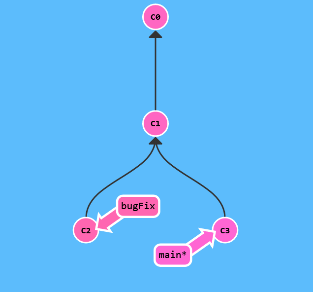
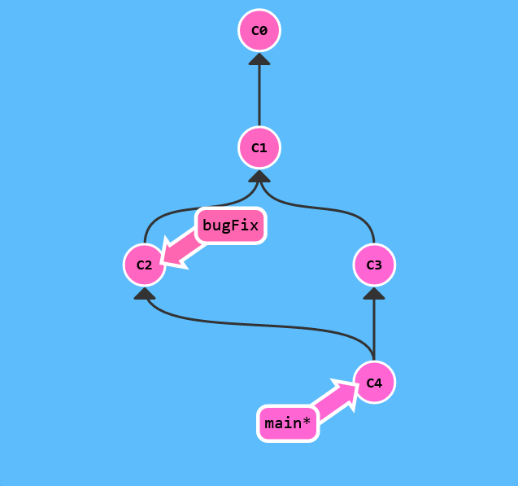
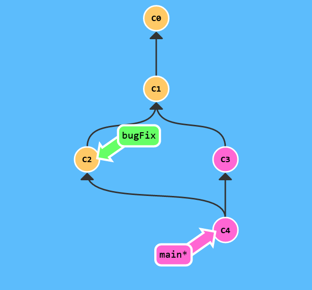
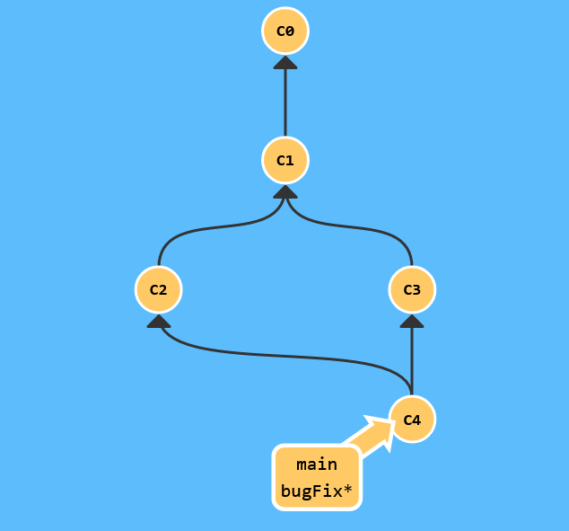

# Merging in Git

Harika! Biz şimdi nasıl commit ve branch yapacağımızı biliyoruz. Şimdi iki farklı branchlardan birlikte gelenleri bir çeşit birleştirme yapacağımızı öğrenmeliyiz. Bu bizim yeni bir geliştirmeyle dallanmamıza izin verecek ve daha sonra onları tekrar birleştireceğiz.

Birleştirmek için ilk method git merge i araştıracağız. Git merge, iki benzersiz ebebeyni olan iki committen özel bir commit oluşturur. Bir committin iki ebebeyni olması demek "Bu ebeveynin tüm çalışmalarını buraya ve bunu buraya ve tüm ebeveynlerinin setini dahil etmek istiyorum."

Burada iki branch var; her biri benzersiz olan bir committe sahip. Bu, hiçbir dalın yaptığınız depodaki tüm "çalışma" setini içermediği anlamına gelir. Hadi bunu merge ile düzeltelim.

bugFix ile main i birleştireceğiz.



``` $> git merge bugFix ```



Wow! gördün mü? Herşeyden önce, main şimdi iki ebeveyni olan bir commit i işaret ediyor. Eğer okları mainden commit ağacında yukarı takip edersen, root a kadar olan yoldaki her committe rastlayacaksın. Bu mainin depondaki tüm çalışmaları şimdi içerdiği anlamına gelir.

Ayrıca, commit renklerinin nasıl değiştiğiniz görüyor musun? Öğrenmemize yardımcı olmak için, bazı renk koordinasyonları dahil ettim. Her branch benzersiz bir renge sahiptir. Her commit bu committi içeren tüm branchların konbinasyonunun karıştırılmış bir renğini döndürür. 




```
$> git checkout bugFix 
$> git merge main 
```



bugFix mainin bir atası olduğundan beri, git herhangi bir çalışma yapmak zorunda kalmadı; sadece bugFix'i main'in eklendiği aynı committe taşıdı. Şimdi tüm commitler her branchın tüm repodaki çalışmaları içerdiği anlamına gelen şekilde aynı renk! Woohoo!
