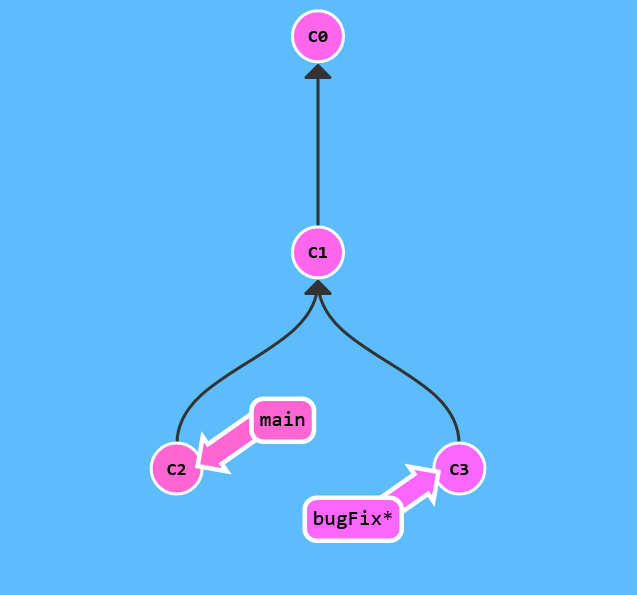
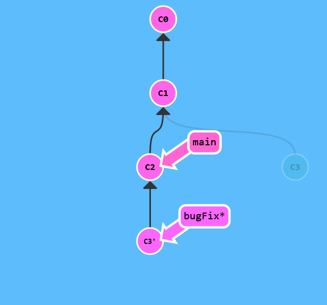
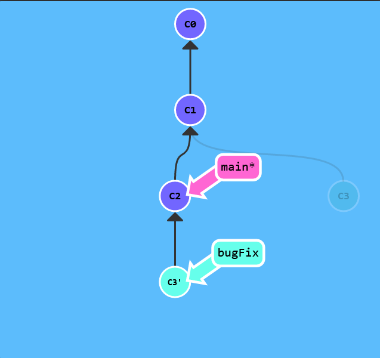

# Rebase Introduction

Branchlar arasındaki işi birleştirmenin ikinci yolu, yeniden temellendirmedir. Yeniden temellendirme, esasen bir dizi commit alır, onları "kopyalar" ve onları başka bir yere indirir.

Bu kulağa kafa karıştırıcı gelse de, yeniden düzenlemenin avantajı, güzel bir doğrusal commit dizisi yapmak için kullanılabilmesidir. Deponun commit günlüğü/geçmişi, yalnızca rebase izin verilirse çok daha temiz olacaktır.

Burada yine iki branchimiz var; bugFix in seçili olduğunu unutmayın (asterisk e dikkat et)

Biz çalışmamızı bugFix'den doğrudan main e taşımak istiyoruz. Bu şekilde, gerçekte paralel olarak geliştirildiklerinde, bu iki özellik sırayla geliştirilmiş gibi görünecektir.

Hadi bunu git rebase komutu ile yapalım.




```$> git rebase main```



Harika! Şimdi bugFix branchimizdeki çalışma, main nin tam üstünde (ok onu gösteriyor.) ve güzel bir doğrusal commitimiz var. C3 commitinin hala bir yerde buluğunu (soluk renkte olan) ve C3'ün main üzerinde yeniden rebase "kopya" olduğunu unutmayın.

Tek sorun main ninde güncellenmemiş olması, şimdi yapalım...

Şimdi main branch e checkout yapacağız. Hadi devam edelim ve bugFix i yeniden temellendirelim.



```$> git rebase bugFix```


İşte orada! main, bugFix in atası olduğu için git basitçe main branch referansını history de ileri ittirdi.
