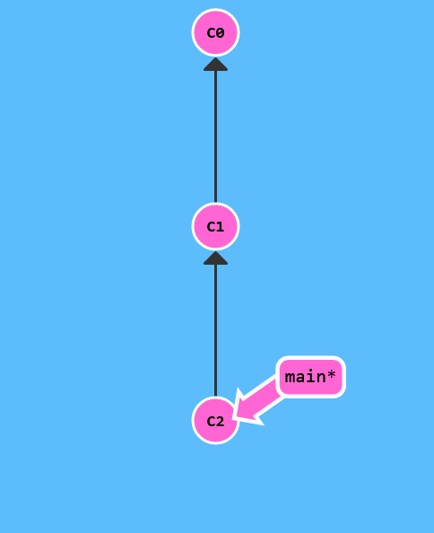

# Git Commits

Git deposundaki bir commit, dizinizdeki tüm (sadece izlenenler) dosyaların anlık görüntüsünü kaydeder. Devasa bir kopyala ve yapıştır gibi, ama daha da iyisi!

Git, commitleri olabildiğinde hafif tutmak istiyor, bu nedenle her commit tüm dizini körü körüne kopyalamaz. (Mümkün olduğunda) bir committi bir dizi değişiklik veya bir "delta" olarak havuzun bir sürümünden diğerine sıkıştırabilir.

Git ayrıca commitlerin ne zaman yapıldığını bir geçmişte tutar. Bu sebeple çoğu commit üzerinde onların ata commitleri vardır -- bunu görselleştirmelerimizde oklarla tanımlarız. Geçmişi korumak proje üzerinde çalışan herkes için harikadır!

Şimdilik commitlerin projelerin anlık görüntüleri olarak düşünebilirsiniz. Commitler çok hafiftir ve aralarında geçiş yapmak çok hızlıdır!

 $>git commit 

İki adet commit var -- birincisi başlangıç commit'i C0, ve bundan sonraki bazı anlamlı değişikliklere sahip olabilecek diğer commit C1

