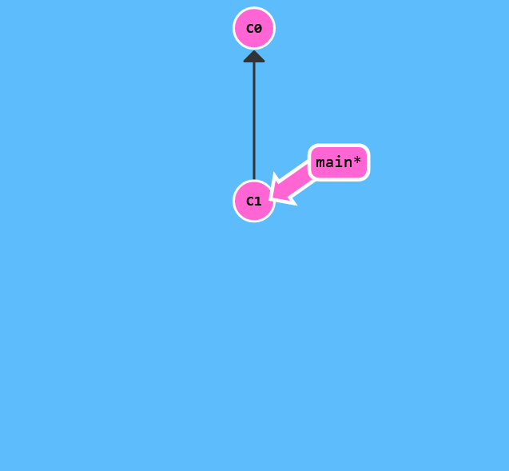
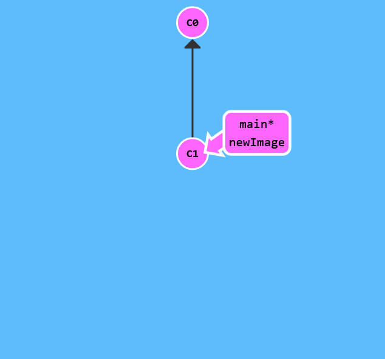
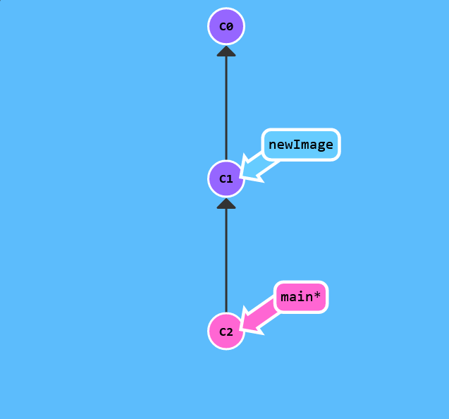
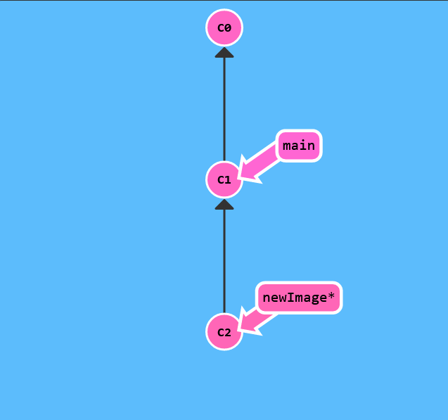

# Git Branches

Branches in Git are incredibly lightweight as well. They are simply pointers to a specific commit -- nothing more. This is why many Git enthusiasts chant the mantra:

branch early, and branch often

Because there is no storage / memory overhead with making many branches, it's easier to logically divide up your work than have big beefy branches.

When we start mixing branches and commits, we will see how these two features combine. For now though, just remember that a branch essentially says "I want to include the work of this commit and all parent commits."

Let's see what branches look like in practice.

Here we will create a new branch named newImage.

$> git branch newImage

$> git commit

Oh no! The main branch moved but the newImage branch didn't! That's because we weren't "on" the new branch, which is why the asterisk (*) was on main.

$> git checkout newImage
$> git commit

Ok! You are all ready to get branching. Once this window closes, make a new branch named bugFix and switch to that branch.

By the way, here's a shortcut: if you want to create a new branch AND check it out at the same time, you can simply type git checkout -b [yourbranchname].
