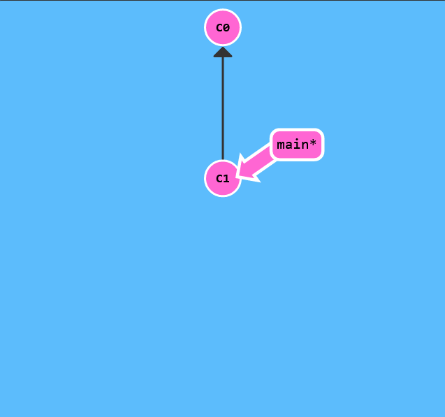
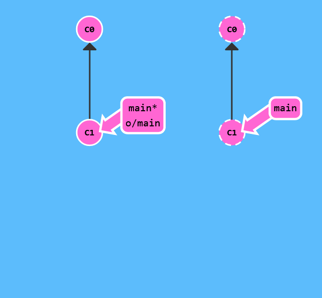

# Clone Intro

Remote repositories aren't actually that complicated. In today's world of cloud computing it's easy to think that there's a lot of magic behind git remotes, but they are actually just copies of your repository on another computer. You can typically talk to this other computer through the Internet, which allows you to transfer commits back and forth.

That being said, remote repositories have a bunch of great properties:

- First and foremost, remotes serve as a great backup! Local git repositories have the ability to restore files to a previous state (as you know), but all that information is stored locally. By having copies of your git repository on other computers, you can lose all your local data and still pick up where you left off.

- More importantly, remotes make coding social! Now that a copy of your project is hosted elsewhere, your friends can contribute to your project (or pull in your latest changes) very easily.

It's become very popular to use websites that visualize activity around remote repos (like GitHub), but remote repositories always serve as the underlying backbone for these tools. So it's important to understand them!

Up until this point, Learn Git Branching has focused on teaching the basics of local repository work (branching, merging, rebasing, etc). However now that we want to learn about remote repository work, we need a command to set up the environment for those lessons. git clone will be that command.

Technically, git clone in the real world is the command you'll use to create local copies of remote repositories (from github for example). We use this command a bit differently in Learn Git Branching though -- git clone actually makes a remote repository out of your local one. Sure it's technically the opposite meaning of the real command, but it helps build the connection between cloning and remote repository work, so let's just run with it for now.

Lets start slow and just look at what a remote repository looks like (in our visualization).



```
$> git clone 
```



There it is! Now we have a remote repository of our project. It looks pretty similar except for some visual changes to make the distinction apparent -- in later levels you'll get to see how we share work across these repositories.
