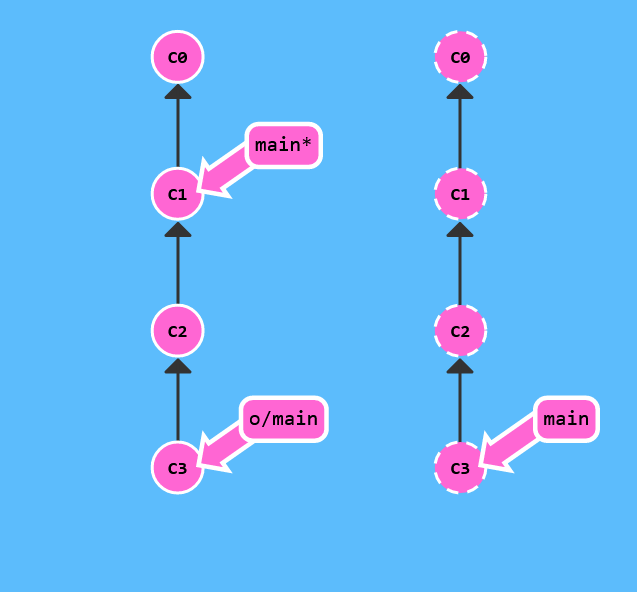

# Git Fetch

Commitleri ileri ve geri gönderdiğimiz sürece, biz git tarafından takip edilen her türlü update i paylaşabiliriz.

Bu derste, remote repodan nasıl veri getireleceğini öğreneceğiz -- bunun için komut uygun bir şekilde git fetch olarak adlandırılır.

Remote repo gösterimlerimi güncellerken, remote branchlerin bu yeni gösterimi yansıtacak şekilde güncelleneceğini fark edeceksiniz. Bu, remote branchleri anlatan önceki derslerle bağlantılıdır.


```
$> git fetch
```



There we go! Commits C2 and C3 were downloaded to our local repository, and our remote branch o/main was updated to reflect this.

What fetch does

git fetch performs two main steps, and two main steps only. It

downloads the commits that the remote has but are missing from our local repository, and updates where our remote branches point (for instance, o/main)

git fetch essentially brings our local representation of the remote repository into synchronization with what the actual remote repository looks like (right now).

If you remember from the previous lesson, we said that remote branches reflect the state of the remote repositories since you last talked to those remotes. git fetch is the way you talk to these remotes! Hopefully the connection between remote branches and git fetch is apparent now.

git fetch usually talks to the remote repository through the Internet (via a protocol like http:// or git://).


What fetch doesn't do

git fetch, however, does not change anything about your local state. It will not update your main branch or change anything about how your file system looks right now.

This is important to understand because a lot of developers think that running git fetch will make their local work reflect the state of the remote. It may download all the necessary data to do that, but it does not actually change any of your local files. We will learn commands in later lessons to do just that :D

So at the end of the day, you can think of running git fetch as a download step.

