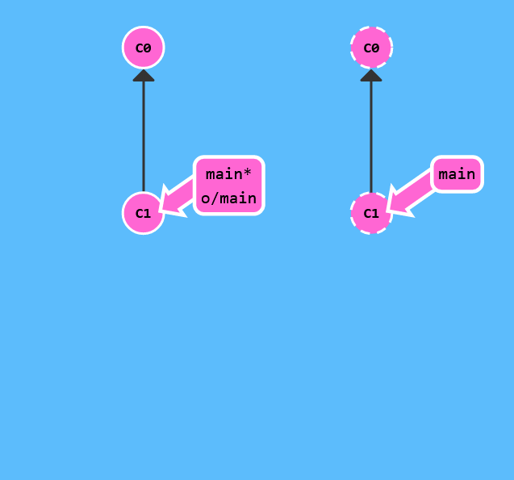
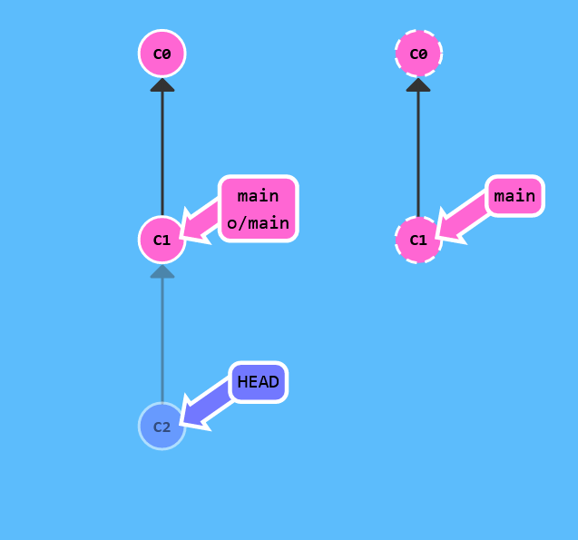

# Remote Branches

Now that you've seen git clone in action, let's dive into what actually changed.

The first thing you may have noticed is that a new branch appeared in our local repository called o/main. This type of branch is called a remote branch; remote branches have special properties because they serve a unique purpose.

Remote branches reflect the state of remote repositories (since you last talked to those remote repositories). They help you understand the difference between your local work and what work is public -- a critical step to take before sharing your work with others.

Remote branches have the special property that when you check them out, you are put into detached HEAD mode. Git does this on purpose because you can't work on these branches directly; you have to work elsewhere and then share your work with the remote (after which your remote branches will be updated).

To be clear: Remote branches are on your local repository, not on the remote repository.

What is o/?

You may be wondering what the leading o/ is for on these remote branches. Well, remote branches also have a (required) naming convention -- they are displayed in the format of:

remote name / branch name

Hence, if you look at a branch named o/main, the branch name is main and the name of the remote is o.

Most developers actually name their main remote origin, not o. This is so common that git actually sets up your remote to be named origin when you git clone a repository.

Unfortunately the full name of origin does not fit in our UI, so we use o as shorthand :( Just remember when you're using real git, your remote is probably going to be named origin!

That's a lot to take in, so let's see all this in action.


Lets check out a remote branch and see what happens.



``` 
$>git checkout o/main
$>git commit
```




As you can see, git put us into detached HEAD mode and then did not update o/main when we added a new commit. This is because o/main will only update when the remote updates.

To finish this level, commit once off of main and once after checking out o/main. This will help drive home how remote branches behave differently, and they only update to reflect the state of the remote.
