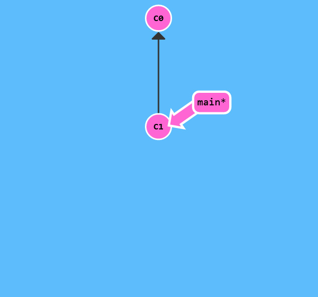
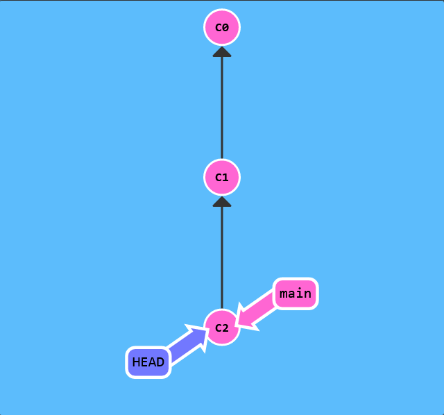
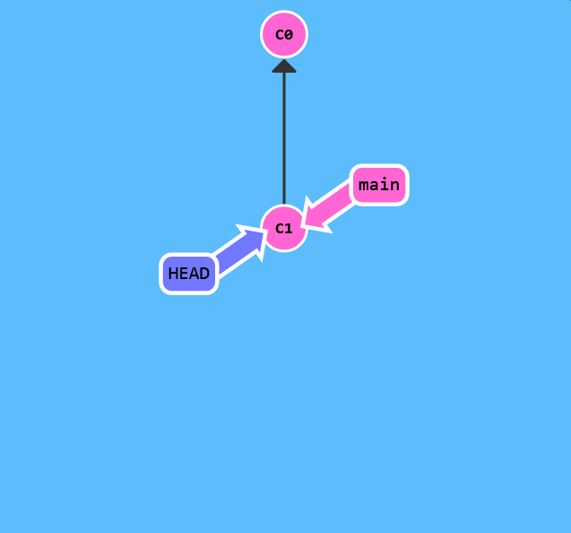

# Detach yo' HEAD

Before we get to some of the more advanced features of Git, it's important to understand different ways to move through the commit tree that represents your project.

Once you're comfortable moving around, your powers with other git commands will be amplified!

First we have to talk about "HEAD". HEAD is the symbolic name for the currently checked out commit -- it's essentially what commit you're working on top of.

HEAD always points to the most recent commit which is reflected in the working tree. Most git commands which make changes to the working tree will start by changing HEAD.

Normally HEAD points to a branch name (like bugFix). When you commit, the status of bugFix is altered and this change is visible through HEAD.



```
$> git checkout C1
$> git checkout main
$> git commit
$> git checkout C2
```


See! HEAD was hiding underneath our main branch all along.

Detaching HEAD

Detaching HEAD just means attaching it to a commit instead of a branch. This is what it looks like beforehand:

HEAD -> main -> C1


``` $> git checkout C1 ```


And now it's

To complete this level, let's detach HEAD from bugFix and attach it to the commit instead.

Specify this commit by its hash. The hash for each commit is displayed on the circle that represents the commit.


HEAD -> C1
