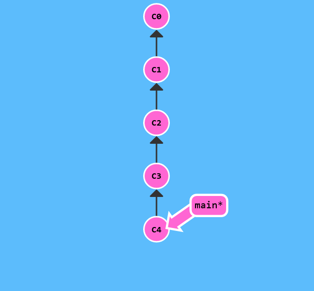
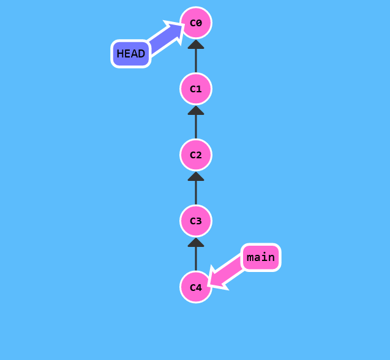
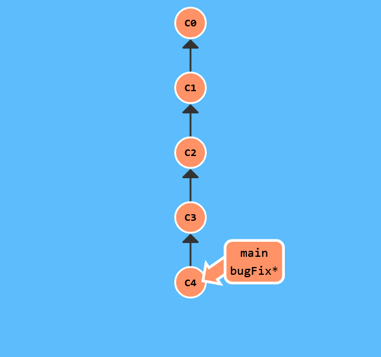
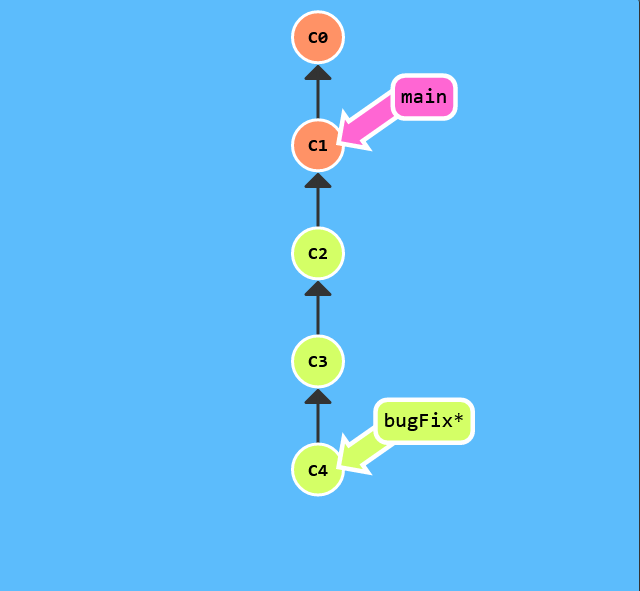

# Relative Refs #2 (~) 


The "~" operator

Say you want to move a lot of levels up in the commit tree. It might be tedious to type ^ several times, so Git also has the tilde (~) operator.

The tilde operator (optionally) takes in a trailing number that specifies the number of parents you would like to ascend. Let's see it in action.


Let's specify a number of commits back with ~.



```$> git checkout HEAD~4```



Boom! So concise -- relative refs are great.

Branch forcing

You're an expert on relative refs now, so let's actually use them for something.

One of the most common ways I use relative refs is to move branches around. You can directly reassign a branch to a commit with the -f option. So something like:

git branch -f main HEAD~3

moves (by force) the main branch to three parents behind HEAD.



```$> git branch -f main HEAD~3```



There we go! Relative refs gave us a concise way to refer to C1 and branch forcing (-f) gave us a way to quickly move a branch to that location.
