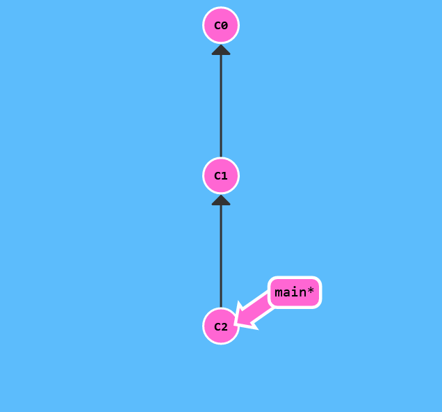
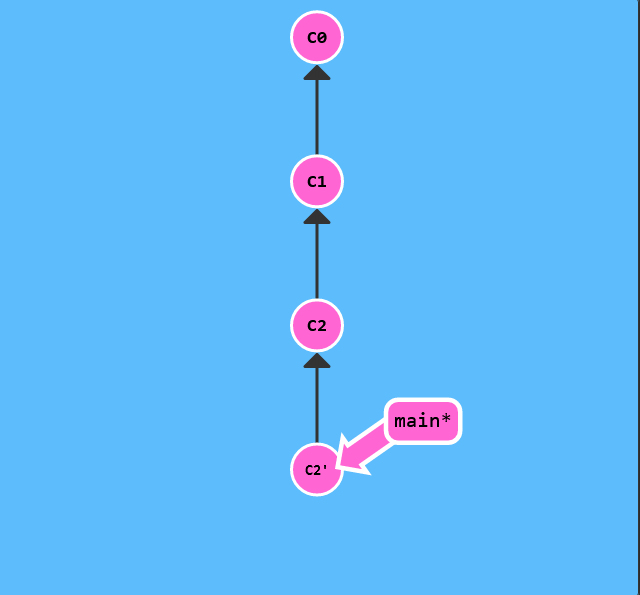

# Reversing Changes in Git

There are many ways to reverse changes in Git. And just like committing, reversing changes in Git has both a low-level component (staging individual files or chunks) and a high-level component (how the changes are actually reversed). Our application will focus on the latter.

There are two primary ways to undo changes in Git -- one is using git reset and the other is using git revert. We will look at each of these in the next dialog

git reset reverses changes by moving a branch reference backwards in time to an older commit. In this sense you can think of it as "rewriting history;" git reset will move a branch backwards as if the commit had never been made in the first place.

Let's see what that looks like:



```$> git reset HEAD~1```


Nice! Git moved the main branch reference back to C1; now our local repository is in a state as if C2 had never happened.

reversed changes with others, we need to use git revert. Let's see it in action.


```$> git revert HEAD```



Weird, a new commit plopped down below the commit we wanted to reverse. That's because this new commit C2' introduces changes -- it just happens to introduce changes that exactly reverses the commit of C2.

With reverting, you can push out your changes to share with others.


To complete this level, reverse the most recent commit on both local and pushed. You will revert two commits total (one per branch).

Keep in mind that pushed is a remote branch and local is a local branch -- that should help you choose your methods.
